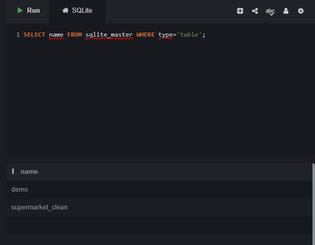
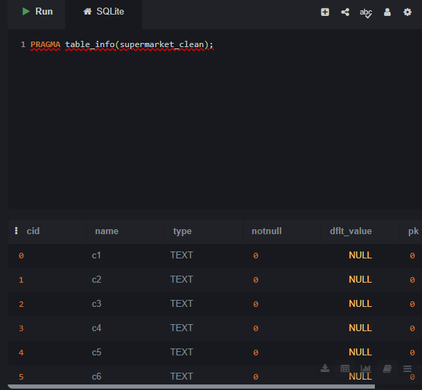
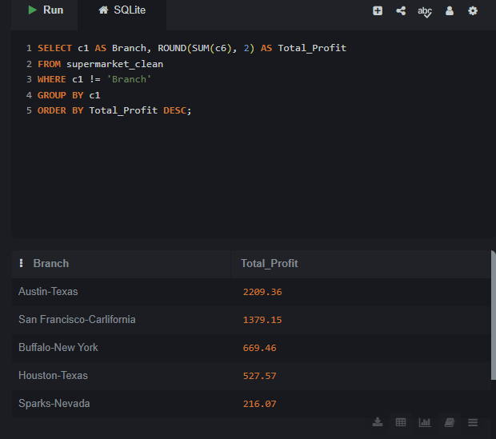
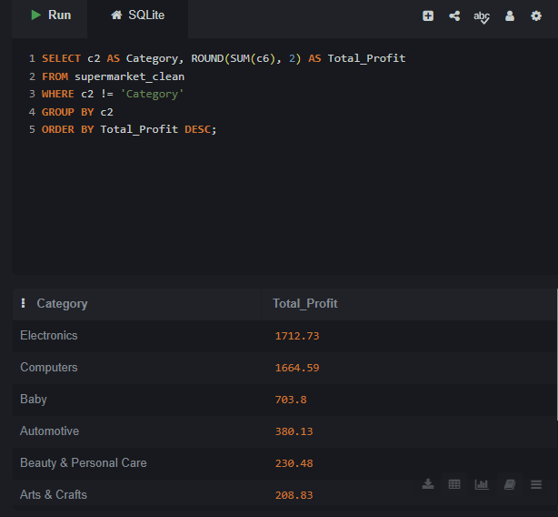
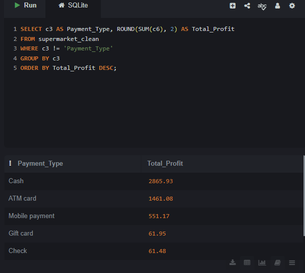
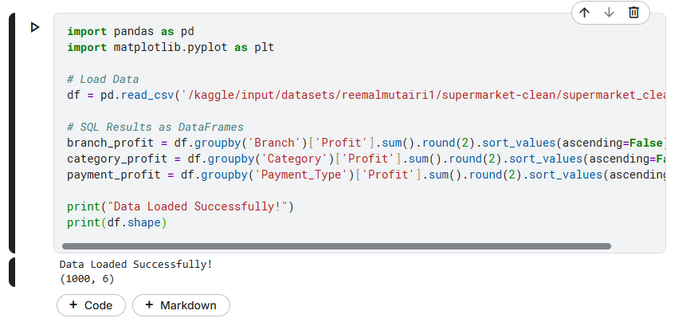
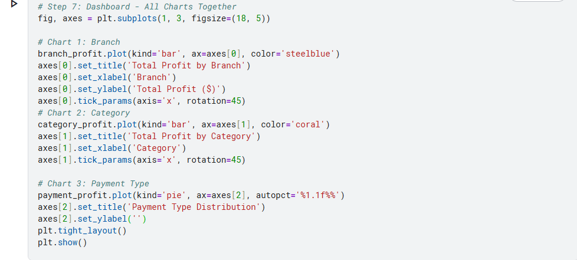
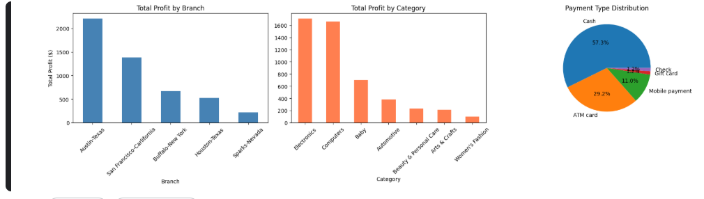

# Supermarket Sales - SQL + Python Analysis

## Problem
Analyze real supermarket sales data using SQL for data extraction
and Python for visualization and dashboard creation.

## Dataset
- Source: Kaggle - Supermarket Sales Dataset
- 1,000 real sales records
- Period: 2021
- Columns: Branch, Category, Payment Type, Order Date, Price, Profit

## Tools Used
- SQL (SQLite) : Data extraction and analysis
- Python (Pandas, Matplotlib) : Visualization and dashboard

## Note on Column Names
Due to CSV import limitations in SQLite Online,
column names were auto-renamed:
- c1 = Branch
- c2 = Category
- c3 = Payment_Type
- c4 = Order_Date
- c5 = Price
- c6 = Profit

## Key Findings
- Total Profit: $5,001.61
- Best Branch: Austin-Texas with $2,209.36
- Best Category: Electronics with $1,712.73
- Most Used Payment: Cash with 57.3%
- Best Month: June with $642.29

## Decision & Recommendations
- Invest more in Austin-Texas as it is the top performer
- Focus on Electronics as it drives most profit
- Encourage Cash payments as they dominate transactions
- Plan promotions in June as it is the best month
- Review Sparks-Nevada branch strategy urgently

## Analysis Steps & Results

### Step 1: Import Data to SQL

### Step 2: Check Table Structure

### Step 3: Total Profit by Branch (SQL)

### Step 4: Total Profit by Category (SQL)

### Step 5: Total Profit by Payment Type (SQL)

### Step 6: Load Data in Python

### Step 7: Dashboard - All Charts Together (Python)

## Files
- supermarket_sql_python_analysis.ipynb : Python notebook
